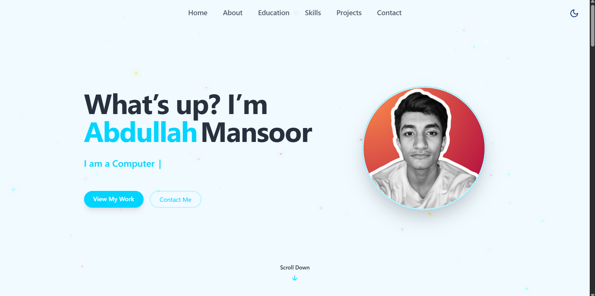
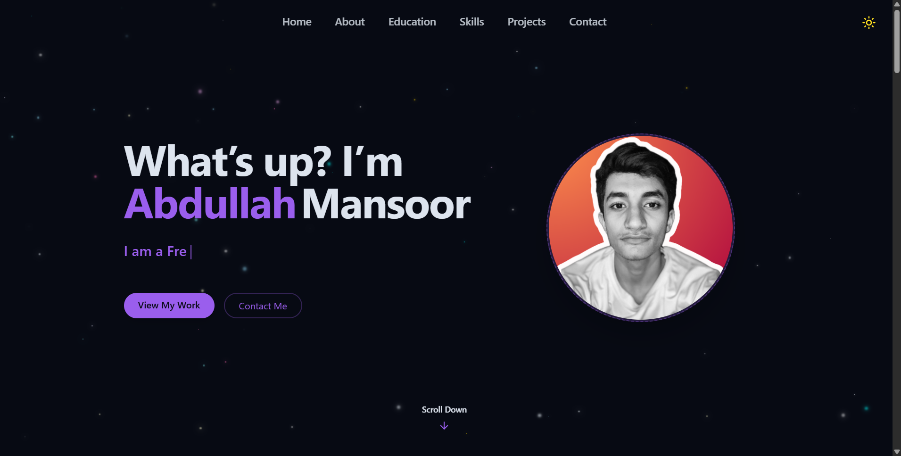
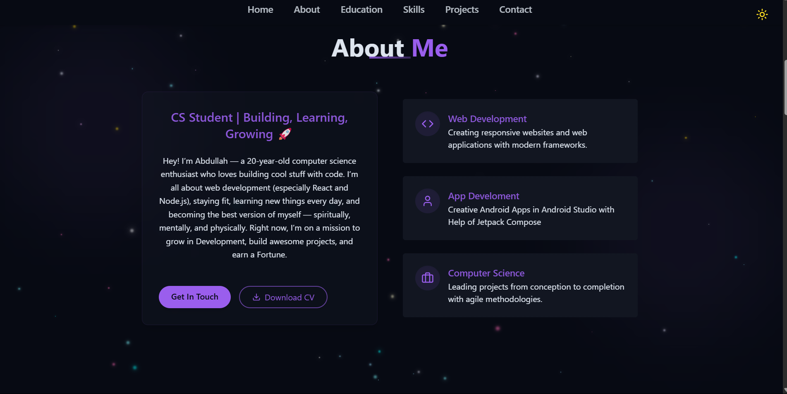
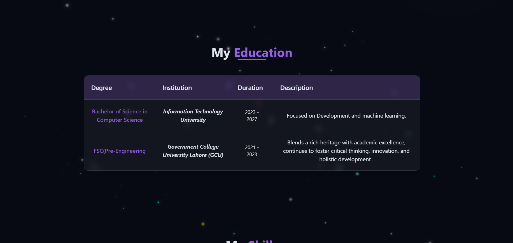
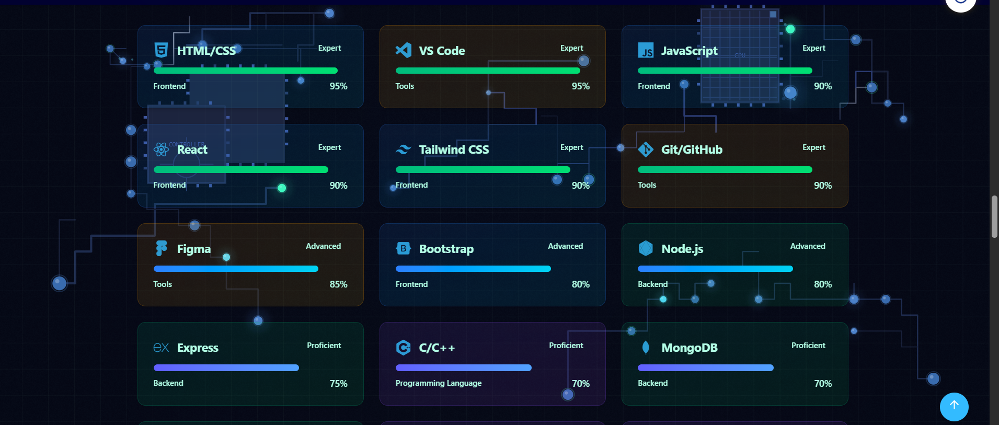

# Abdullah Mansoor - Portfolio Website

A modern, responsive portfolio website built with React, Vite, and Tailwind CSS showcasing professional skills, projects, and contact information.








## 🚀 Features

- **Interactive UI**: Modern design with smooth animations and transitions
- **Responsive Layout**: Optimized for all devices (mobile, tablet, desktop)
- **Dark/Light Mode**: Toggle between themes with persistent preference
- **Loading Screen**: Engaging initial loading animation
- **Animated Components**: Text scrambler effect, typing animation, and more
- **Sections**:
  - Hero section with dynamic text effects
  - About section with personal info and services
  - Education timeline
  - Skills with interactive filtering
  - Projects showcase
  - Contact form with validation
  - Footer with social links

## 🛠️ Technologies Used

- [React 18](https://reactjs.org/)
- [Vite](https://vitejs.dev/) - Next Generation Frontend Tooling
- [Tailwind CSS 4](https://tailwindcss.com/) - Utility-first CSS framework
- [React Router](https://reactrouter.com/) - For navigation/routing
- [AOS](https://michalsnik.github.io/aos/) - Animate On Scroll library
- [Lucide React](https://lucide.dev/) - Beautiful & consistent icon toolkit
- [FontAwesome](https://fontawesome.com/) - Icon library for social media icons
- [Radix UI](https://www.radix-ui.com/) - Accessible component primitives

## 🚦 Getting Started

### Prerequisites

- Node.js 16+ and npm/yarn installed

### Installation

1. Clone the repository
   ```bash
   git clone https://github.com/your-username/portfolio-website.git
   cd portfolio-website
   ```

2. Install dependencies
   ```bash
   npm install
   # or
   yarn install
   ```

3. Start the development server
   ```bash
   npm run dev
   # or
   yarn dev
   ```

4. Open your browser and visit `http://localhost:5173`

## 🔧 Available Scripts

- `npm run dev` - Start the development server
- `npm run build` - Build for production
- `npm run preview` - Preview the production build locally
- `npm run lint` - Run ESLint to check for code issues

## 📂 Project Structure

```
portfolio-website/
├── public/              # Static assets
│   ├── projects/        # Project images and resume
│   └── vite.svg         # Favicon
├── src/                 # Source code
│   ├── assets/          # Additional assets
│   ├── components/      # React components
│   │   └── ui/          # UI components (toast, etc.)
│   ├── hooks/           # Custom React hooks
│   ├── lib/             # Utility functions
│   ├── pages/           # Page components
│   ├── App.jsx          # Main App component
│   ├── index.css        # Global styles
│   └── main.jsx         # Entry point
├── .eslintrc.cjs        # ESLint configuration
├── .gitignore           # Git ignore file
├── index.html           # HTML entry point
├── package.json         # Project dependencies
├── README.md            # Project documentation
└── vite.config.js       # Vite configuration
```

## 🎨 Customization

- **Personal Information**: Update details in respective component files
- **Projects**: Modify the projects array in `src/components/ProjectsSection.jsx`
- **Skills**: Update skills in `src/components/SkillsSection.jsx`
- **Colors/Theme**: Modify theme variables in `src/index.css`
- **Resume**: Replace the CV file in `public/projects/CV.pdf`

## 🌐 Deployment

This site can be easily deployed to platforms like:
- [Vercel](https://vercel.com/)
- [Netlify](https://www.netlify.com/)
- [GitHub Pages](https://pages.github.com/)

### Build for Production

```bash
npm run build
# or
yarn build
```

## 📄 License

This project is licensed under the MIT License.

## 👨‍💻 Author

**Abdullah Mansoor**
- GitHub: [Abdullah-608](https://github.com/Abdullah-608)
- LinkedIn: [abdullah-608-mansoor](http://www.linkedin.com/in/abdullah-608-mansoor)
- Email: abdullahmansoor608@gmail.com

---

Feel free to use this template for your own portfolio and customize it as needed! If you have any questions or suggestions, don't hesitate to reach out.
